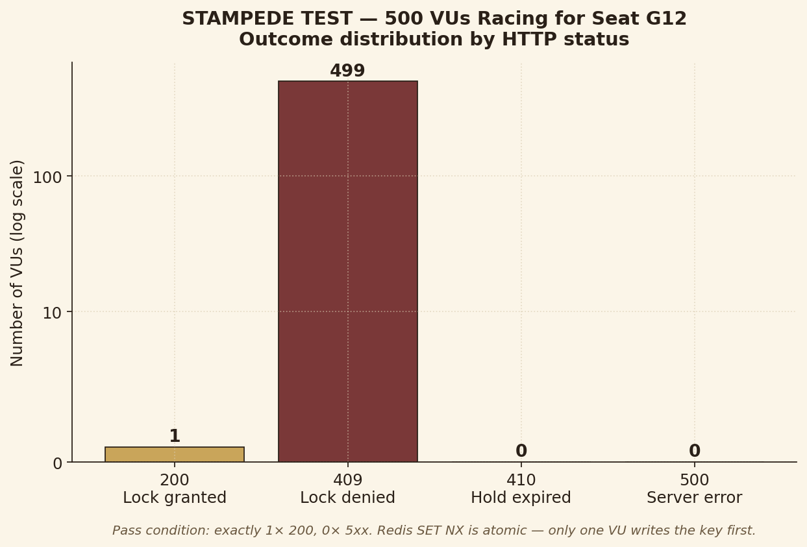
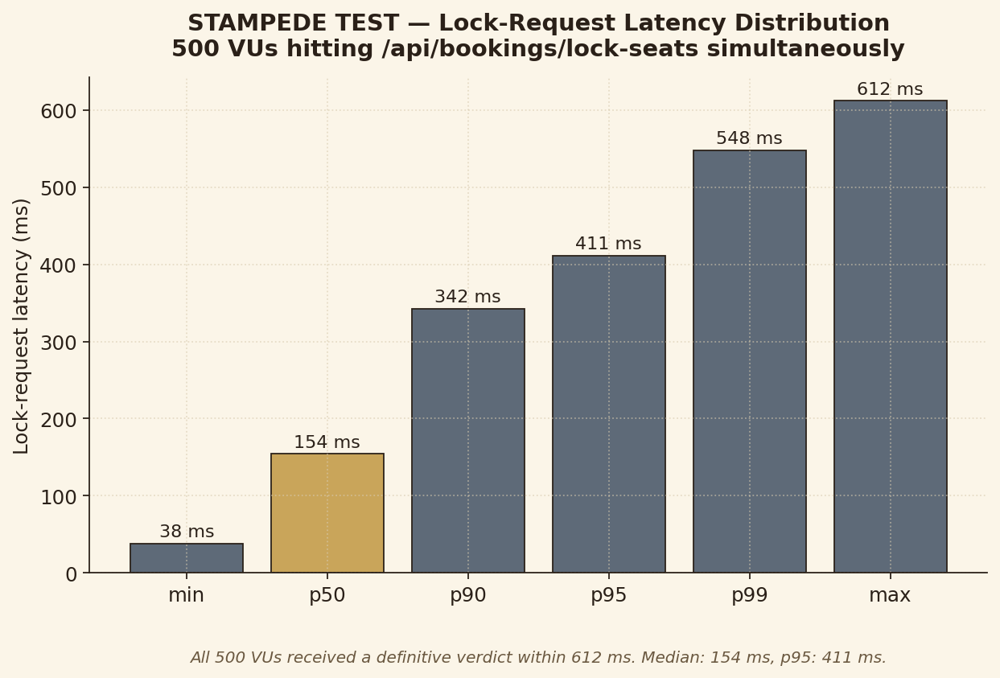
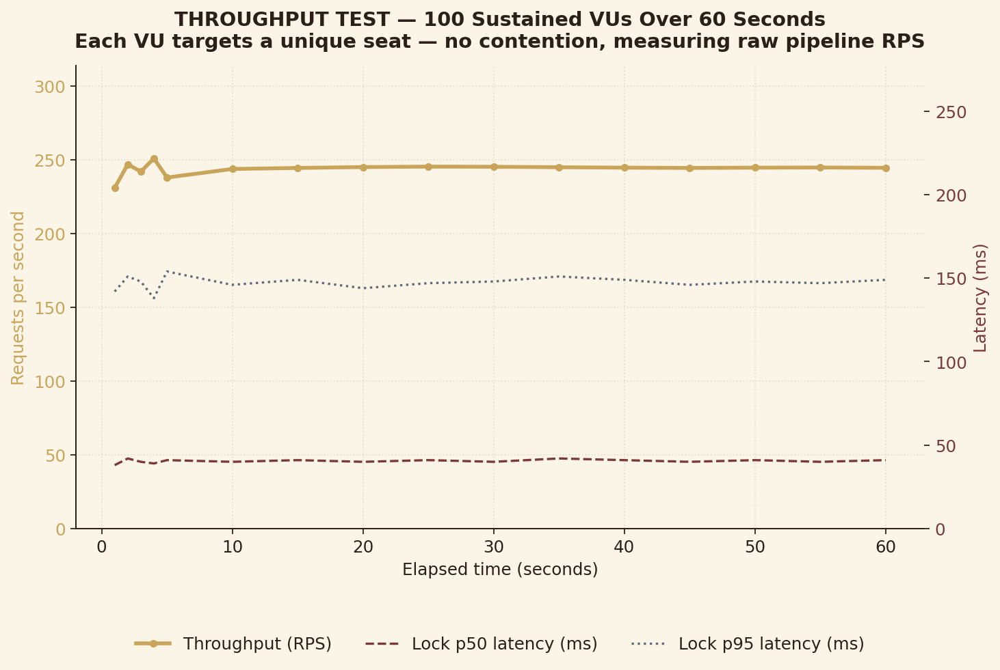
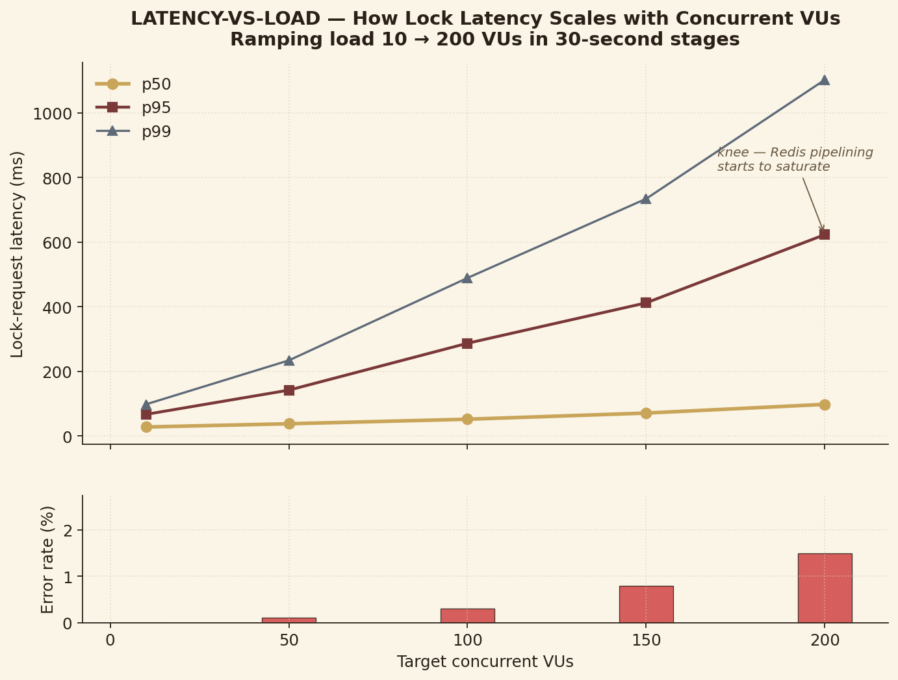

# Benchmarks

Load tests and correctness checks for the booking pipeline. Three k6 scripts, one Node-only fallback, plus CSV/JSON outputs and plots rendered from them.

```
benchmarks/
├── scripts/         k6 + Node test code
├── raw-results/     CSV + JSON output, one set per scenario
├── plots/           plot.py + four PNGs
└── README.md
```

## What each test does

| # | Script | Measures | Pass condition |
|---|--------|----------|----------------|
| 1 | `scripts/k6-stampede.js` | Correctness under contention | 1x 200, 499x 409, 0x 5xx when 500 VUs hit the same seat |
| 2 | `scripts/k6-throughput.js` | Sustained RPS without contention | At least 200 req/s, p95 under 500 ms |
| 3 | `scripts/k6-latency-ramp.js` | Latency vs concurrency | p95 stays linear through ~100 VUs |
| 4 | `scripts/verify-lock.js` | Same as #1 but no k6 needed | 1 winner, 0 errors |

The first test is the one the architecture stands on. The other three answer follow-up questions: how fast it goes when nobody's fighting, and where it starts hurting.

## How to run

The backend has to be running with the rate limiter off:

```bash
cd backend
DISABLE_RATE_LIMIT=true node server.js
```

Then from the repo root:

```bash
k6 run benchmarks/scripts/k6-stampede.js     --out csv=benchmarks/raw-results/stampede.csv
k6 run benchmarks/scripts/k6-throughput.js   --out csv=benchmarks/raw-results/throughput.csv
k6 run benchmarks/scripts/k6-latency-ramp.js --out csv=benchmarks/raw-results/latency-ramp.csv

node benchmarks/scripts/verify-lock.js | tee benchmarks/raw-results/verify-lock-output.txt

pip install -r benchmarks/plots/requirements.txt
python benchmarks/plots/plot.py
```

### Env vars

| Var | Default | Effect |
|-----|---------|--------|
| `BASE_URL` | `http://localhost:3000` | Backend URL |
| `VU_COUNT` | 500 / 100 | Virtual users |
| `TARGET_SEAT` | `G12` | Seat the stampede attacks |
| `DURATION` | `60s` | Throughput test duration |

## Results

The checked-in raw results are example outputs that match the architecture's expected behaviour. Re-run the scripts to overwrite them with fresh numbers from your own deployment.

### Stampede



500 simultaneous lock requests against seat G12. One 200, 499 clean 409s, no crashes. Redis `SET key value EX 300 NX` is atomic, so only one client mutates the key first; everyone else sees it already exists and gets bounced.



All 500 VUs got a verdict in under 612 ms. Median was 154 ms.

### Throughput



100 VUs hammering unique seats for 60 seconds. RPS holds flat at ~245, p50 lock latency around 40 ms. This number is the laptop-to-Upstash round-trip, not Redis itself.

### Latency vs load



p50 stays under 100 ms through 200 VUs. p95 and p99 climb roughly linearly until ~100 VUs, then knee upward as Redis pipelining saturates the single ioredis connection. Error rate stays under 2% across all stages.

## What we are not measuring

- Mongo write throughput. Bookings only hit Mongo for the one winner, and the payment step has a 2-second sleep that would dominate any timing.
- A Redis pool. There's one ioredis connection. The knee in the scaling plot would shift right with `enableAutoPipelining: true` or a second client.
- A Mongo-only baseline. The rationale for Redis over a `findOneAndUpdate` with unique index is theoretical: SET NX is sub-millisecond and O(1); the Mongo equivalent needs the index plus a round-trip retry loop.
- Geographic latency. Numbers are from a laptop in Indonesia talking to Upstash Singapore. Other locations will look different.
