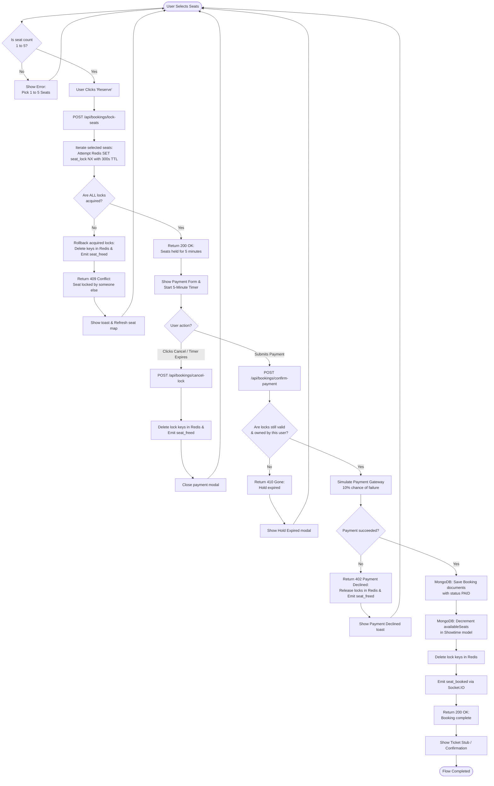
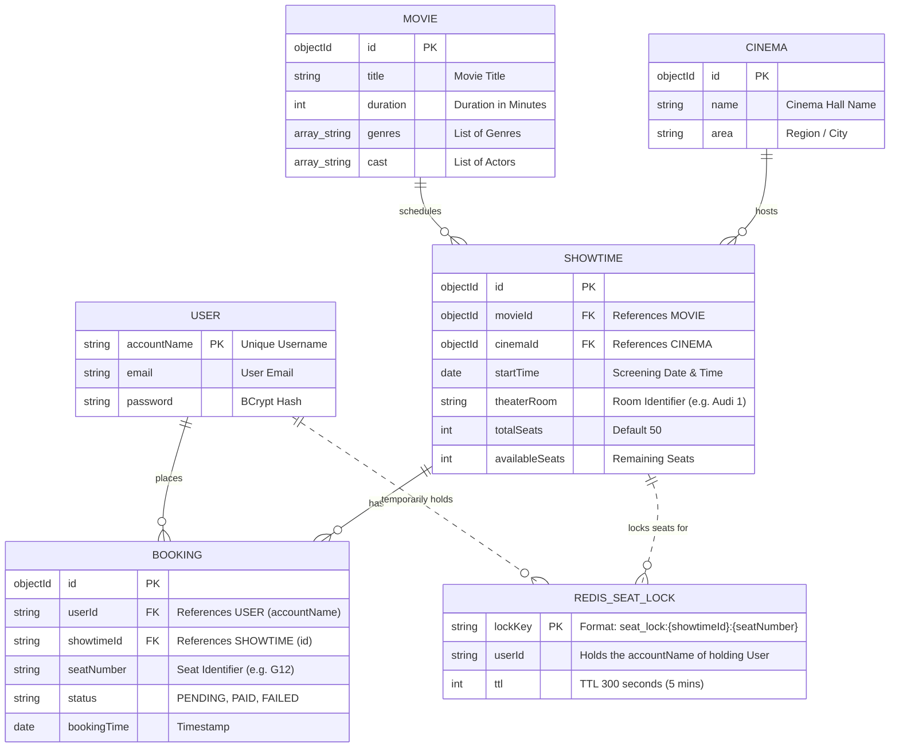
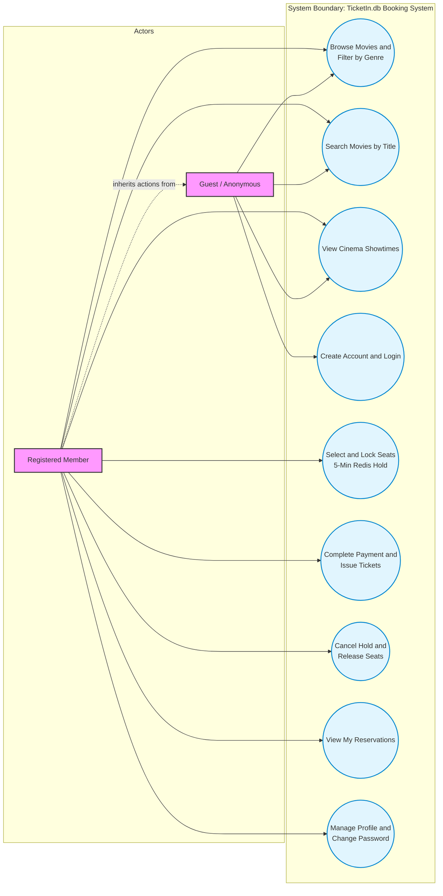
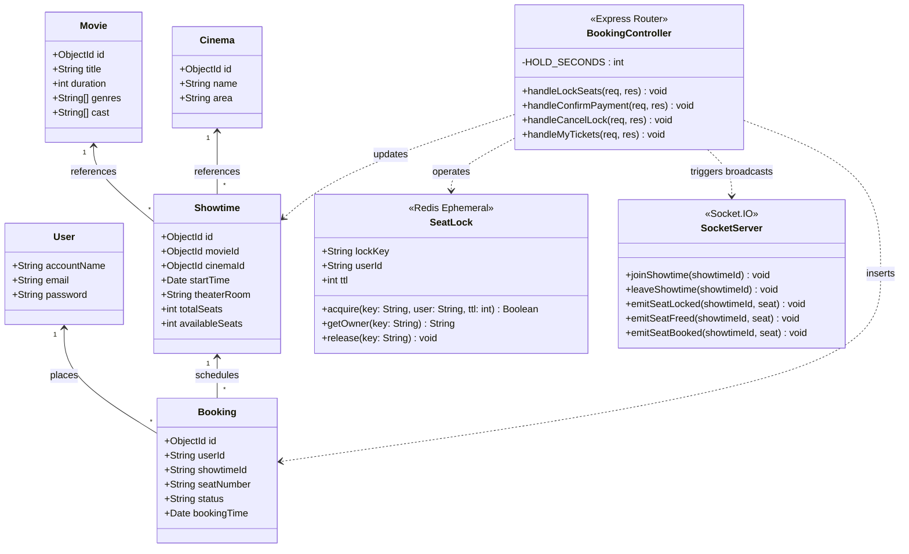

# Database Schemas and Diagrams

This document explains how our database is structured and shows the UML diagrams for our ticket booking system.

---

## 1. MongoDB Database Schemas

We use MongoDB as our main database to store permanent data. We build our models with Mongoose. Here is how our data collections are organized.

### 1.1 User Schema (users collection)
This collection holds user accounts and registration data.

*   `accountName` (String, Required, Unique): The username that acts as a unique ID to identify each user.
*   `email` (String, Optional): The user email address.
*   `password` (String, Required): Hashed password using bcrypt.

### 1.2 Movie Schema (movies collection)
This collection contains the list of movies currently screening in our cinemas.

*   `title` (String, Required): Movie title.
*   `duration` (Number, Required): Total running time in minutes.
*   `genres` (Array of Strings): Genres like Action, Drama, or Sci-Fi.
*   `cast` (Array of Strings): Names of the main actors in the movie.

### 1.3 Cinema Schema (cinemas collection)
This collection stores the physical location details for each cinema.

*   `name` (String, Required): The name of the cinema hall.
*   `area` (String, Required): The city region where the cinema is located, such as North or South.

### 1.4 Showtime Schema (showtimes collection)
This collection connects a movie to a specific cinema at a specific time.

*   `movieId` (ObjectId, Required): Reference pointing directly to a Movie document.
*   `cinemaId` (ObjectId, Required): Reference pointing directly to a Cinema document.
*   `startTime` (Date, Required): The exact screening date and time.
*   `theaterRoom` (String, Required): The name of the theater hall (for example, Audi 2).
*   `totalSeats` (Number, Default: 50): Total seating capacity of this room.
*   `availableSeats` (Number, Default: 50): The number of seats currently left for booking.

### 1.5 Booking Schema (bookings collection)
This collection saves every ticket that has been successfully paid for.

*   `userId` (String, Required): Reference matching the user's `accountName`.
*   `showtimeId` (String, Required): Reference matching the Showtime ID.
*   `seatNumber` (String, Required): The specific seat number (for example, F12).
*   `status` (String, Enum: `['PENDING', 'PAID', 'FAILED']`, Default: `PAID`): Payment status.
*   `bookingTime` (Date, Default: `Date.now`): The exact time the booking was placed.

---

## 2. Redis Key Structure for Seat Locks

We use Upstash Redis as a high-speed lock manager to make sure users do not buy the same seat at the same time. This keeps our main MongoDB database safe from getting overwhelmed.

### 2.1 Key Design
*   **Key format**: `seat_lock:{showtimeId}:{seatNumber}`
    *   *Type*: String
    *   *Example*: `seat_lock:60c72b2f9b1d8a001c8d4512:G12`
*   **Value**: `userId` (contains the `accountName` of the user currently holding the seat)
*   **TTL**: 300 seconds (which gives the user a 5 minute hold)

### 2.2 How the Lock Works
1.  When a user chooses a seat and clicks reserve, the server runs this Redis command:
    ```redis
    SET seat_lock:{showtimeId}:{seatNumber} {userId} EX 300 NX
    ```
2.  If the seat is already locked by someone else, Redis returns null and the server returns a 409 Conflict status.
3.  If the lock is successful, Redis saves the key. The seat status changes to "IN CHECKOUT" on other screens in real time using Socket.IO.

---

## 3. System Diagrams (Mermaid)

### 3.1 Booking Flowchart
This diagram shows the path from choosing a seat to final payment.



---

### 3.2 Entity Relationship Diagram (ERD)
This diagram shows how our MongoDB documents relate to each other and the temporary lock in Redis.



---

### 3.3 Use Case Diagram
This diagram shows the actions that anonymous guests and registered members can perform.



---

### 3.4 Class Diagram
This diagram shows the relationship between our models, controllers, and Socket.IO.


